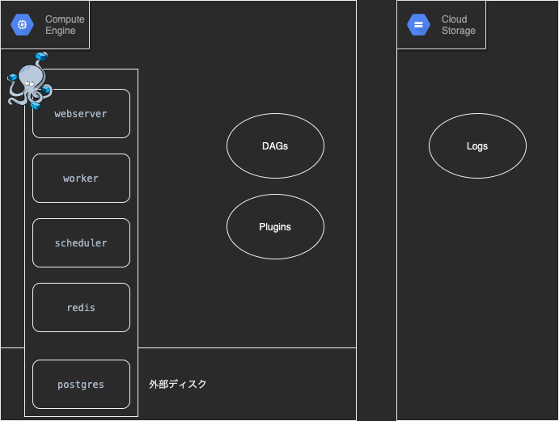
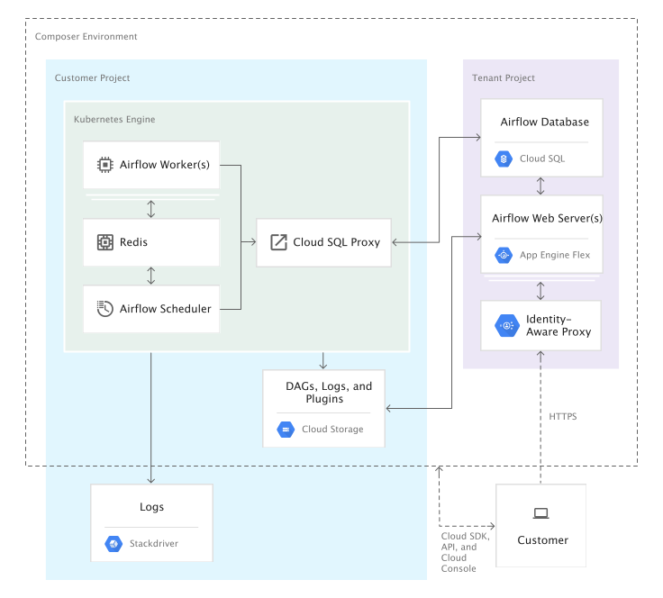

# 構成

- 

- Airflow の CeleryExecutor の構成(webserver,worker,scheduler,postgres,redis)を docker-compose on GCE で運用
  - `n1-standard-1` では動かなかったので最低 `n1-standard-2` が必要
- DB データの永続化
  - GCE の外部ディスク
- タスクログの保管先
  - GCS
- CI
  - GitHub actions
- 認証
  - Application Default Credentials(GCE のメタデータサーバー)を利用した認証
  - https://medium.com/google-cloud-jp/gcp-%E3%81%A8-oauth2-91476f2b3d7f
- ファイアウォール
- VM イメージビルド
  - Packer

ちなみに Cloud Composer の構成はこんな感じ

- 
  - https://cloud.google.com/composer/docs/concepts/overview?hl=ja#architecture

# docker-compose を採用する理由

- すでに運用実績のあるイメージがあった
  - [puckel/docker-airflow](https://github.com/puckel/docker-airflow)
- postgres を web サーバーと同時に停止したい
- 月額 5000 円以下で運用するため

# やったこと

- ベースは[puckel/docker-airflow](https://github.com/puckel/docker-airflow)
- airflow を`1.10.10`にバージョンアップ
- ライブラリの更新フローを作成
  - requirements.txt と requirements.lock を導入
- docker ホストのプロビジョニング
- コンテナイメージを GCR へ登録
- 外部ディスクを使用した DB の永続化
- fire wall の設定
- .env の追加
- サービスアカウントの鍵の管理を辞める
- log を GCS に書き出し、読み出し
- local でも GCE でも動くようにしたこと
  - マウント先を考慮してある

# 課題

- task のエラーを拾う
- `airflow`コマンドを使用したテストを追加する
  - できるけどまだやっていないだけ
- airflow サーバーの監視の設定
  - できるけどまだやっていないだけ

# 環境構築

## VM イメージの作成

- VM イメージの変遷
  - `ubuntu-1804-bionic-v20200529`
    → `airflow-server` (`make host-init`)
    → `airflow-server-has-deploykey` (deploy_key の追加、ディスクのフォーマット)

### イメージ:airflow-server の作成

`make host-init` を実行  
一度 GCE でインスタンスを作成すると、GCE 用のデフォルトのサービスアカウントが作成される。  
デフォルトのサービスアカウントに使用するリソースの権限を付与しておく。

### イメージ:airflow-server-has-deploykey の作成

##### deploykey を登録

以下コマンドで deploykey を登録する

```
su -l airflow
mkdir .ssh/
ssh-keyscan github.com >> .ssh/known_hosts
ssh-keygen -f .ssh/id_git_rsa -t rsa -N ""
tee .ssh/config <<EOF >/dev/null
Host github github.com
  HostName github.com
  IdentityFile /home/airflow/.ssh/id_git_rsa
  User git

EOF

cat /home/airflow/.ssh/id_git_rsa.pub
# 公開鍵をgithubに登録する
ssh -T git@github.com
```

##### 外部ディスクのフォーマット(ディスク新規作成時のみ)

boot ディスクとは別のディスクを用意し、postgres のデータの保存先として使用している。  
(airflow の DB 情報を永続化できるようにするため。)

追加ディスクのデバイス名をコンソールから確認しておく

```
# https://www.apps-gcp.com/gce-disk-expansion/
sudo su -l root
ls -lA /dev/disk/by-id/ # 追加されたされたディスクがどこにマウントされているかを確認
# フォーマットする
mkfs.ext4 -F -E lazy_itable_init=0,lazy_journal_init=0,discard /dev/disk/by-id/google-persistent-disk-1;
```

#### ディスクをイメージファイル化する

インスタンス(airflow-pro-init)を停止し、以下のコマンドでイメージファイルを作成する。

```
make make-hostimage
```

## GCR にコンテナイメージを登録する

Container Registry の API を有効化した後、以下を実行する。

```
make up-gcr
```

## ファイヤーウォールを作成する

※ デフォルトではどこの IP からも許可しているので注意してください

```
make firewall-init
```

## タスクログ保管用の GCS を init する

```
make gcs-init
```

## Airflow を deploy する

`make deploy`

# 環境ごとに変更すべき箇所

- GCP project id
   - <gcp_project_id>
- GCS bucket 名
   - <gcs_bucket>
- GitHub repository 名
   - <gh_repository>
- GCE default service account 名
   - <default_service_account>
